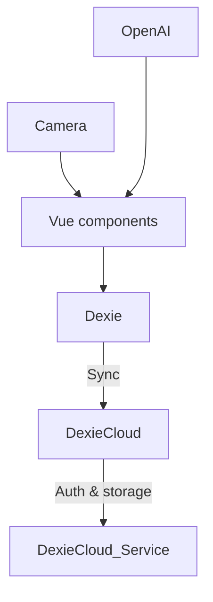

# CellarSense 🍷

Track your wine cellar across all your devices – **offline‑first** PWA with automatic cloud sync powered by **Dexie Cloud**.

---

## ✨ Features

- Works 100 % offline thanks to IndexedDB (Dexie.js).
- Automatic real‑time sync so every logged‑in user sees the same cellar.
- Password‑less e‑mail login (built‑in Dexie Cloud auth).
- Scan bottle labels (front **and** back) – let _OpenAI_ fill the wine details for you.
- Installable PWA (home‑screen icon, camera access, background sync).
- Tiny, modern Vue 3 + Vite codebase.

---

## 🏗️ Tech Stack

| Layer               | Package / Service        |
| ------------------- | ------------------------ |
| Framework           | Vue 3 (`<script setup>`) |
| Build               | Vite                     |
| UI                  | Tailwind CSS             |
| Local datastore     | Dexie.js                 |
| Cloud sync + auth   | Dexie Cloud              |
| AI helper           | OpenAI API               |
| PWA / ServiceWorker | Vite PWA plugin          |

---

## ▶️ Live demo

[https://michielryvers.github.io/cellar-sense/](https://michielryvers.github.io/cellar-sense/)

---

## 🚀 Quick start (local dev)

```bash
git clone https://github.com/michielryvers/cellar-sense.git
cd cellar-sense
npm install
npm run dev
```

The app will open on [http://localhost:5173](http://localhost:5173).
Hot‑module reloading **and** Dexie Cloud sync both work from the dev server.

---

## 🔑 Required setup

### 1. OpenAI key

1. Create an API key at [https://platform.openai.com/account/api-keys](https://platform.openai.com/account/api-keys).
2. Paste the key in the Settings modal of the running app.

> The key is only stored in your browser (localstorage) at runtime and is **never** committed to git.

### 2. Dexie Cloud project

1. **Create a database**

   ```bash
   npx dexie-cloud create
   ```

2. **Whitelist your dev origin** (and later your production URL):

   ```bash
   npx dexie-cloud whitelist http://localhost:5173
   ```

3. Copy the `https://XXXX.dexie.cloud` URL and paste it in the settings modal.

The first time a user opens the app they will be asked for their e‑mail address and receive a magic‑link – no extra auth code or servers required.

---

## 📜 Scripts

| Command           | What it does                |
| ----------------- | --------------------------- |
| `npm run dev`     | Start Vite dev server       |
| `npm run build`   | Production build to `dist/` |
| `npm run preview` | Serve built app locally     |

---

## 🌳 Architecture



- **IndexedDB‑first** – all reads/writes happen locally for instant UI.
- **Dexie Cloud** watches the change feed and pushes/pulls deltas whenever the browser is online. Conflicts default to “last writer wins”, but you can add field‑level merge logic.
- Everything runs in the browser; the only backend you deploy is Dexie Cloud (serverless, free tier up to 3 prod users).

---

## 🤝 Contributing

PRs and issue reports are welcome!

---

## 📄 License

MIT © 2025 Michiel Ryvers
